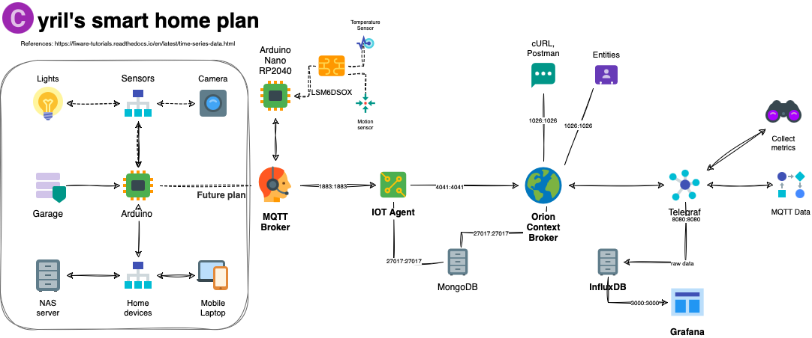

# Arduino_Project-IOT
* Welcome to my first official Arduino IOT project.
* The goal of this project is to create a smart-home implementation using my **Arduino RP2040**.  
* As a start the Arduino will monitor the internal temperature.
* Future plan is to connect other smart devices and ultimately monitor the whole house.

## Todo list
### The project is now postponned, because my Arduino connector broke :/
- [x] Implement all Docker images.
- [x] Connect Arduino to the MQTT client and publish the data.
- [x] Visualize data from Arduino on Grafana dashboard 
- [ ] Start a Telegram bot that will notify you about events.
- [ ] Enable more functionalitios for InfluxDB
- [ ] Improve Grafana dashboards

## Issues list
- [ ] https://github.com/nightguarder/Arduino_Project-IOT/issues/1 
- [ ] https://github.com/nightguarder/Arduino_Project-IOT/issues/2#issue-1552306923
- [ ] https://github.com/nightguarder/Arduino_Project-IOT/issues/5
## Orion Context Broker
> The brain of your IOT network. Orion is a C++ implementation of the NGSIv2 REST API binding developed as a part of the FIWARE platform.
* To access Orion go to: `http://localhost:1026/v2` 
## IOT Agent
> An IoT Agent is a component that lets a group of devices sends their data to and be managed from a Context Broker using their own native protocols. The API used here is NGSIv2.
* To access IOT Agent go to: `http://localhost:4041/iot/about`
* [Implementation example](https://fiware-tutorials.readthedocs.io/en/latest/iot-agent.html#22-request)
## MQTT Broker
> MQTT is a publish-subscribe-based messaging protocol used in the internet of Things
* Serves as a middleman between IOT devices (sensors) and Fiware network. 

## Telegraf
>Telegraf is a server-based agent for collecting and sending all metrics and events from databases, systems, and **IoT sensors**.
* The raw data is sent to **InfluxDB**, therefore you can visualize them in **Grafana**.
* How does it work? [Telegraf intro](https://www.influxdata.com/time-series-platform/telegraf/)
## InfluxDB
>Smart data collector for your IOT devices.
* Introduction to InfluxDB [Documentation](https://awesome.influxdata.com/docs/part-1/introduction-to-influxdb/)
## MongoDB
>Simple database image to hold temporary data.
* Used by the Orion Context Broker to hold context data information such as data entities, subscriptions and registrations
* Used by the IoT Agent to hold device information such as device URLs and Keys
## Grafana 
> Visually display the data from IOT devices (sensors).
* By default Grafana will have an InfluxDB configured with the available data.   
* To access grafana go to: `http://localhost:30001`   

## Prerequsities & References:
* Must have knowledge: [Orion Context basics](https://youtu.be/pK4GgYjlmdY)
* Fiware IOT MQTT documentation: [Fiware docs](https://fiware-tutorials.readthedocs.io/en/latest/iot-over-mqtt.html)
* Fiware IOT MQTT repository: [Github repo](https://github.com/FIWARE/tutorials.IoT-over-MQTT)

## Checklist:
- [x] Installed Docker on your system. *previous experience recommended*
- [x] Arduino (RP2040)
   - Arduino device or extensions that can connect to MQTT broker via Wi-fi
- [x] Postman or cURL command interface
- [x] Programming skills
- [x] Patience & time

## Setup:
0. Laptop (PC) should be connected to the same network as Arduino (Hotspot)
1. ./services start
   - Check if all docker images are running
2. In new terminal run: 
   - **MQTT subriber**
` docker logs --tail 10 mosquitto `
- to check if mqtt is running and arduino01 is connected
` docker run -it --rm --name mosquitto_sub --network fiware_arduino_default   --platform linux/amd64 efrecon/mqtt-client:latest sub -h mosquitto -p 1883 -t '/#' `
- to run the subscriber and listen to data incoming from arduino
3. Run Script
   - temperature_sensor.py
   - door_detection.py
